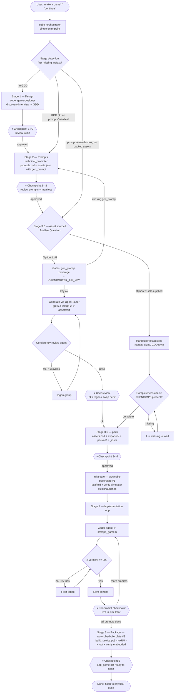

# WowCube Game Pipeline — User Flow

End-to-end flow driven by `cube_orchestrator`, from a user request to a
device-ready `.oct`. `⏸` marks a mandatory checkpoint where the orchestrator
stops and waits for explicit user approval — it never auto-advances.

## Legend

- **Rounded nodes** — user-facing start/end.
- **Rectangles** — work done by a sub-skill or subagent.
- **Diamonds** — decisions (stage detection, asset-source choice, verification gates).
- **`{{ ⏸ … }}`** — mandatory checkpoints: the orchestrator stops and waits for explicit user approval. The per-prompt checkpoint (Stage 4) and every stage boundary are non-negotiable.

## Stage summary

| Stage | Owner | Produces |
|-------|-------|----------|
| 1. Design | `cube_game-designer` | `plans/<game>_gdd.md` |
| 2. Prompts | `technical_prompter` | `plans/<game>_prompts.md` + `plans/<game>_assets.json` (per-sprite `gen_prompt`) |
| 3. Assets | `cube_asset-builder` (+ consistency reviewer) | `assets/packed/*.png`, `pal.png`, `assets/mp3/*.mp3`, `src/app_<game>_ids.h` |
| Infra gate | `wowcube-boilerplate` (#1) | scaffolded `app_<game>/`, verified **simulator** build |
| 4. Implement | coder / verifier / fixer subagents | `src/app_<game>.h` (per prompt, sim-tested) |
| 5. Package | `wowcube-boilerplate` (#2) | `app_<game>/app_<game>.oct` (ARM embedded, verified) |

## Key points

- **Single entry point:** the user always talks to `cube_orchestrator`; it routes.
- **Two asset sources (Stage 3.0):** AI generation via an OpenRouter/GPT Image 2 key, or self-supplied assets validated for completeness before packing. Both converge on `pack`.
- **`wowcube-boilerplate` runs twice:** first to bring up the **simulator** before coding (so each prompt is testable), then at the end for the authoritative **device `.oct`** (built once because the simulator clobbers the `.oct` on every run).
- **Resume-safe:** on any re-entry, stage detection reads the filesystem/context and continues from the first incomplete stage.
