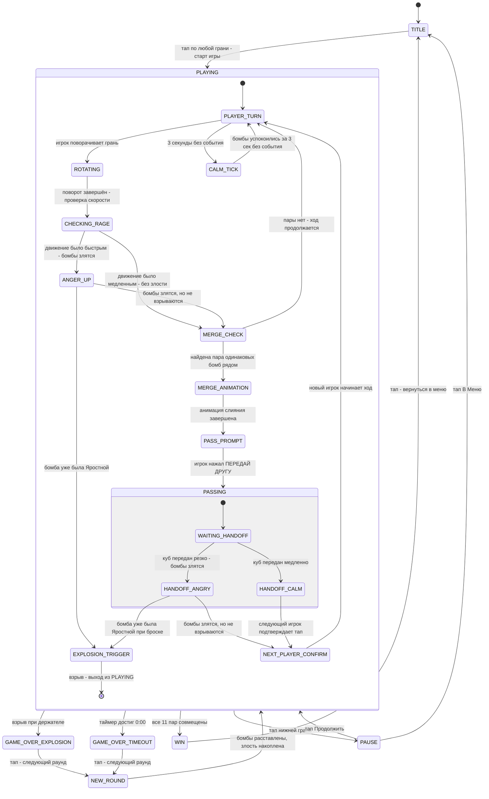

# Party Bombs: Бомбокуб Дефьюз — Game Design Document

## 1. Концепция

### Обзор

**Party Bombs: Бомбокуб Дефьюз** — это динамичная казуальная игра-головоломка для нескольких игроков, в которой нужно совмещать пары одинаковых бомб путём вращения граней куба (механика 2048), передавая куб по кругу. Главная опасность — резкие движения злят бомбы и грозят взрывом, поэтому каждый игрок должен действовать аккуратно. Игрок, в чьих руках куб взорвётся, выбывает.

### Стиль и референсы

- **Арт-стиль**: Kawaii-мультяшный — пухлые формы, толстые контуры, яркие насыщенные цвета, выразительные эмоции на лицах бомб
- **Жанр**: Казуальная головоломка + физическая координация + мультиплеер
- **Референсы**: Angry Birds (мимика персонажей), Plants vs. Zombies (яркая мультяшность), Bomb Party (механика «передай куб»), 2048 (механика слияния)
- **Цветовая палитра**: Тёплые пастельные фоны экранов (бежевый, розовый, голубой), яркие многоцветные бомбы, красно-оранжевые акценты опасности
- **Настроение**: Весёлая паника — игра нарочито напряжённая, но с юмором

### Скоуп

**MVP (минимально работающая версия):**

Фундамент:
- [ ] 22 экрана с бомбами + 2 служебных экрана на верхней грани
- [ ] 11 типов бомб (по 2 штуки каждого типа = 22 бомбы) случайно распределены по 22 экранам в начале раунда
- [ ] Каждая бомба имеет текущее эмоциональное состояние: Спокойная / Злая / Яростная / Влюблённая
- [ ] Глобальный обратный отсчёт (таймер) на верхней грани

Основные механики:
- [ ] Поворот грани сдвигает бомбы по ряду из 8 экранов (повёрнутая грань + 4 соседних) в стиле 2048
- [ ] При попадании двух одинаковых бомб на соседние позиции они сливаются в «Влюблённую» бомбу
- [ ] После слияния освобождённый экран остаётся пустым (фон)
- [ ] Слияние всех 11 пар = победный экран «КУБ ОБЕЗВРЕЖЕН!»

Механика злости (акселерометр):
- [ ] Акселерометр отслеживает скорость поворота грани: если оборот занял менее 3 секунд — бомбы злятся
- [ ] Акселерометр отслеживает скорость передачи куба между игроками: резкий бросок = бомбы злятся
- [ ] Бомба злеет по шкале: Спокойная → Злая → Яростная
- [ ] Без новых резких движений бомба успокаивается обратно за 3 секунды
- [ ] Если бомба в состоянии «Яростная» получает ещё удар — ВЗРЫВ с цепной реакцией

Передача куба:
- [ ] После удачного слияния на служебном экране появляется кнопка «ПЕРЕДАЙ ДРУГУ!»
- [ ] Текущий игрок нажимает (тапает) кнопку и аккуратно передаёт куб следующему игроку
- [ ] Следующий игрок тапает грань для подтверждения приёма куба и начала своего хода

Система раундов:
- [ ] При взрыве текущий игрок выбывает, начинается новый раунд с той же стартовой расстановкой бомб
- [ ] В каждом новом раунде один из типов бомб начинает в состоянии «Злая» (накапливается от раунда к раунду)
- [ ] Игра продолжается, пока все не выбудут или пока не будет достигнута победа

Вторичные механики:
- [ ] «Датчик спокойствия» на служебном экране: полоска с эмодзи отображает текущий уровень опасности
- [ ] Таймер меняет цвет с жёлтого на красный при приближении к нулю
- [ ] Когда время выходит — взрыв у текущего держателя

UI и фидбек:
- [ ] Анимация слияния: вспышка + сердечки при появлении «Влюблённой» бомбы
- [ ] Анимация взрыва: 4-кадровая последовательность (вспышка → огонь → взрывная волна → дым)
- [ ] Цепная реакция: все бомбы на кубе взрываются одновременно при первом взрыве
- [ ] Экран «УСПЕХ! КУБ ОБЕЗВРЕЖЕН!» при победе
- [ ] Экран «БУМ! ВРЕМЯ ВЫШЛО. КУБ ДЕТОНИРОВАЛ.» при поражении

Звук:
- [ ] Звук успешного слияния (приятный «дзинь» или «тю-тю»)
- [ ] Звук злости бомбы (короткий раздражённый звук)
- [ ] Звук взрыва (громкий «БУМ!»)
- [ ] Тиканье таймера в финальные 10 секунд

**Будущие функции (за пределами MVP):**
- Таблица рекордов / счёт выживших
- Дополнительные типы бомб с уникальными эффектами (замораживающая, ускоряющая)
- Режим соло (против AI-таймера)
- Настройка длительности таймера
- Эффекты частиц при взрыве (конфетти, осколки)
- Звуковые реплики бомб (смешные крики злости)

### Допущения дизайна

- 24 экрана куба — 2 служебных на верхней грани = 22 экрана для бомб. При 11 типах бомб × 2 = ровно 22 — все экраны заняты. Принято как оптимальный баланс.
- Типы бомб: Круглая, Граната, Динамит, Кубическая (синяя), Пирамидная (зелёная), Кристаллическая (фиолетовая), Сфера-лёд (голубая), Тыква, Звёздная, Ракета, Череп-бомба — итого 11 типов. Финальный набор утверждается с художником.
- Кнопка «ПЕРЕДАЙ ДРУГУ!» = тап по левому верхнему экрану служебной грани.
- «Ход» одного игрока = одно удачное слияние пары бомб.
- Начало нового раунда: бомбы возвращаются на стартовые позиции (та же расстановка), злость накапливается.
- Максимальное количество игроков не ограничено — насколько хватит физических игроков вокруг куба.

---

## 2. Как играется

### Общий процесс

Игроки собираются вокруг куба. Первый игрок берёт куб в руки. На верхней грани виден обратный таймер и датчик спокойствия. На остальных 5 гранях — 20 экранов с бомбами (плюс 2 экрана с бомбами на верхней грани).

**Задача**: вращением граней собрать пары одинаковых бомб рядом, чтобы они «влюбились» и нейтрализовались. Нужно обезвредить все 11 пар до взрыва.

### Механика перемещения бомб (стиль 2048)

Когда игрок поворачивает грань, все бомбы в «ряду» из 8 экранов (4 экрана грани + 4 соседних экранов на смежных гранях) сдвигаются в направлении поворота — как плитки в 2048:
- Бомбы скользят до упора в конец ряда (до пустого места или края)
- Если две одинаковые бомбы оказываются рядом — они сливаются в «Влюблённую» бомбу
- Слияние происходит одно за поворот (если несколько пар совпало — сливается ближайшая к краю)
- После слияния на месте одной из двух бомб остаётся пустой экран (слияние уменьшает количество бомб)

**Что видит игрок**: бомбы плавно скользят по экранам при повороте, при совпадении — вспышка и анимация появления влюблённой бомбы (сердечки вокруг).

### Механика злости (датчик спокойствия)

Датчик спокойствия на служебном экране — это шкала с эмодзи: от спокойного зелёного смайла до яростного красного, с промежуточными состояниями.

**Что злит бомбы**:
1. **Быстрый поворот**: если грань была повёрнута быстрее, чем за 3 секунды — это «грубо»
2. **Резкая передача**: если при передаче куба акселерометр фиксирует резкий рывок или встряску — бомбы злятся

**Как злость работает**:
- При каждом «грубом» событии бомбы на кубе сдвигаются на один уровень злости вверх: Спокойная → Злая → Яростная
- Если через 3 секунды после события нет новых резких движений — бомбы успокаиваются на один уровень вниз: Яростная → Злая → Спокойная
- Злость визуально отображается на каждой бомбе (выражение лица) и на датчике спокойствия
- Если бомба находится в состоянии «Яростная» и происходит ещё одно грубое событие — немедленный ВЗРЫВ

**Визуальные состояния бомбы**:

| Состояние | Внешний вид | Поведение |
|-----------|-------------|-----------|
| Спокойная | Умиротворённое лицо, тлеющий фитиль | Стоит спокойно |
| Злая | Хмурые брови, лёгкие искры на фитиле | Слегка подрагивает |
| Яростная | Красный цвет, яростная мимика, большие искры, дым | Активно трясётся, вибрирует |
| Влюблённая | Сердечки вместо глаз, румянец | Покачивается радостно, неактивна |
| Взрывающаяся | 4-кадровая анимация взрыва | Цепная реакция всего куба |

### Накопление злости между раундами

- В начале Раунда 1 все бомбы спокойны
- После взрыва/выбывания игрока начинается Раунд 2: один случайно выбранный тип бомб (например, «Круглая») стартует уже в состоянии «Злая»
- В Раунде 3 этот же тип становится «Яростным» с самого начала — один грубый удар = взрыв
- Раунд 4 и далее: «Яростный» тип взрывается при старте (или сразу же при первом движении), а новый тип начинает свой путь злости
- Остальные типы бомб в каждом раунде начинают Спокойными

### Механика передачи куба

После успешного слияния пары на двух служебных экранах загорается большая кнопка **«ПЕРЕДАЙ ДРУГУ!»** с иконкой замка. Это сигнал для текущего игрока:

1. Нажать (тапнуть) служебный экран с кнопкой
2. Медленно и аккуратно передать куб следующему игроку
3. Следующий игрок получает куб и тапает любую боковую грань для начала своего хода
4. Кнопка «ПЕРЕДАЙ» гаснет, ход переходит

Пока горит кнопка «ПЕРЕДАЙ» — поворот граней является **штрафным действием**: если кто-то осмелится повернуть грань в этот момент, все бомбы немедленно взрываются. Это создаёт дополнительное напряжение при передаче куба — не дёргай лишнего!

⚠️ **Внимание**: резкий бросок куба при передаче фиксируется акселерометром и злит бомбы!

### Победа и поражение

**Победа**: все 11 пар слиты в «Влюблённых» — куб полностью обезврежен. На всех экранах появляется экран «УСПЕХ! КУБ ОБЕЗВРЕЖЕН!» с анимацией праздника.

**Поражение (взрыв)**:
- Таймер дошёл до нуля
- Или бомба взорвалась из-за резкого движения

При взрыве: цепная реакция — все 22 бомбы взрываются одновременно, на всех экранах анимация взрыва, затем экран «БУМ! ВРЕМЯ ВЫШЛО. КУБ ДЕТОНИРОВАЛ.» Проигравший — тот, кто держал куб в момент взрыва.

---

## 3. Игровые объекты

| Объект | Внешний вид | Поведение | Макс. на экране |
|--------|-------------|-----------|-----------------|
| Бомба (11 типов × 4 состояния) | Kawaii-персонаж своей формы с выражением лица по состоянию | Отображает текущее состояние (Спокойная/Злая/Яростная/Влюблённая), реагирует на слияние | 22 (по одной на экран, кроме слитых) |
| Взрывающаяся бомба | 4-кадровая анимация: искра → огонь → взрыв → дым | Проигрывается один раз при детонации | До 22 одновременно |
| Фоновая плита экрана | Монотонный пастельный фон, уникальный для каждого типа бомбы | Статичный, не двигается | 22 |
| Служебный экран — Таймер | Цифровой дисплей MM:SS в стиле LED, жёлтый → красный | Обратный отсчёт, мигает при <10 сек | 1 (верхняя грань, левый экран) |
| Служебный экран — Статус | «ПЕРЕДАЙ ДРУГУ!» кнопка ИЛИ «Датчик спокойствия» | Переключается между режимами: ожидание / передача | 1 (верхняя грань, правый экран) |
| Датчик спокойствия | Полоска с 5 эмодзи (от зелёного до красного) и ползунком | Показывает текущий уровень злости бомб | В составе служебного экрана |
| Экран победы | Яркий праздничный фон, надпись «УСПЕХ! КУБ ОБЕЗВРЕЖЕН!» | Анимированный, показывается поверх всего | 1 (занимает всю переднюю грань) |
| Экран поражения | Тёмный дымный фон, надпись «БУМ! ВРЕМЯ ВЫШЛО. КУБ ДЕТОНИРОВАЛ.» | Появляется после анимации взрыва | 1 (занимает всю переднюю грань) |
| Экран паузы | Три кнопки: Продолжить / Настройки / В Меню | Отображается поверх игры при тапе в паузу | 1 |
| Титульный экран | «БОМБОКУБ ДЕФЬЮЗ» + кнопка СТАРТ | Ждёт тапа для начала | 1 |

### Типы бомб (11 штук)

1. **Круглая бомба** — тёмно-серый шар с фитилём
2. **Ананасовая граната** — золотистая рифлёная граната
3. **Динамит** — красная цилиндрическая шашка с фитилём
4. **Кубическая бомба** — синий куб с заклёпками
5. **Пирамидная бомба** — зелёная пирамида
6. **Кристаллическая бомба** — фиолетовый кристалл-алмаз
7. **Ледяная сфера** — голубой прозрачный шар со льдом
8. **Тыквенная бомба** — оранжевая тыква с фитилём
9. **Звёздная бомба** — жёлтая 5-конечная звезда с фитилём
10. **Ракета-бомба** — красно-белая ракета с носком
11. **Бомба-череп** — чёрный череп с мигающими глазами

### Бюджет спрайтов

- 11 типов бомб × 4 состояния = 44 спрайта бомб (каждый ~140×140px)
- 11 типов × 1 анимация взрыва (4 кадра) = 44 взрывных кадра (но для MVP можно 1 общая анимация = 4 кадра)
- 22 фоновых плиты (уникальные фоны можно оптимизировать до 11 уникальных)
- 2 служебных экрана + датчик спокойствия = ~10 спрайтов
- Экраны меню, победы, поражения, паузы = ~20 спрайтов
- Итого: **~120–140 спрайтов** в худшем случае (далеко до лимита 400)
- На экране одновременно: 22 бомбы + 2 служебных = **максимум ~50–60 видимых спрайтов**

> ✅ Бюджет в норме — гораздо ниже лимита 400. Есть запас для анимаций и UI-элементов.

---

## 4. Прогрессия и сложность

### Структура раунда

Один **раунд** — это полная игровая сессия от старта до взрыва или победы.

**Шкала нарастающей сложности между раундами:**

| Раунд | Сложность |
|-------|-----------|
| 1 | Все 11 типов бомб Спокойные. Стандартный таймер. |
| 2 | 1 тип бомб стартует Злым. Один грубый удар сделает его Яростным. |
| 3 | 1 тип бомб стартует Яростным — достаточно одного грубого удара для взрыва. Второй тип стартует Злым. |
| 4+ | Яростный тип заменяется новым. Накопление продолжается. |

### Победа

**Условие победы**: все 11 пар бомб слиты в «Влюблённых» до истечения таймера.
- Показывается экран «УСПЕХ! КУБ ОБЕЗВРЕЖЕН!»
- Отображается оставшееся время как результат

### Поражение / Выбывание

**Условие поражения (выбывание игрока)**:
- Таймер достиг нуля у текущего игрока
- Или бомба взорвалась из-за резкого движения при текущем держателе

**После выбывания**:
- Экран «БУМ!» отображается всем
- Новый раунд: бомбы возвращаются на стартовые позиции  
- Один тип бомб становится на уровень злее (+1 к шкале злости)
- Таймер сбрасывается

### Таймер

- Начальное время: 3 минуты (настраивается в разделе Настройки в будущем)
- Цвет таймера: жёлтый → оранжевый (при 1 мин) → красный (при 30 сек) → мигающий красный (при 10 сек)
- При достижении 0:00 — немедленный взрыв

---

## 5. Управление

| Ввод | Действие |
|------|----------|
| Поворот грани (медленный, >3 сек) | Сдвигает бомбы по ряду из 8 экранов в стиле 2048. При совпадении пары — слияние. Бомбы НЕ злятся. |
| Поворот грани (быстрый, <3 сек) | То же движение бомб, НО бомбы злятся на один уровень вверх. |
| Полуповорот (медленный) | Частичное смещение бомб — можно использовать для тонкого позиционирования. Бомбы НЕ злятся. |
| Полуповорот (быстрый) | Частичное смещение + бомбы злятся. |
| Тап по служебному экрану (кнопка «ПЕРЕДАЙ ДРУГУ!») | Подтверждает завершение своего хода, разрешает передачу куба. |
| Тап по любой боковой грани | Подтверждение приёма куба новым игроком, начало его хода. |
| Тап по любой грани (на экране Паузы) | Навигация по меню паузы. |
| Наклон/гравитация | Не используется в геймплее. |
| Акселерометр — плавное движение | Служебное отслеживание: НЕ злит бомбы. |
| Акселерометр — резкий рывок/встряска | Злит бомбы на один уровень вверх (детектится при передаче куба). |

> **Примечание по управлению**: Поворот грани — основной инструмент игрока. «Быстрый» означает, что весь поворот от начала до конца занял менее 3 секунд. Этот параметр определяется через метрику `disconnected_ms` при каждом повороте.

---

## 6. Экраны и фидбек

### Расположение информации по граням

**Верхняя грань (TOP) — 4 экрана:**
- Экран TOP-левый-верхний: **Таймер** (цифровой обратный отсчёт MM:SS)
- Экран TOP-правый-верхний: **Статус** (датчик спокойствия ИЛИ кнопка «ПЕРЕДАЙ ДРУГУ!»)
- Экраны TOP-нижние (2 штуки): **Бомбы** (как на остальных гранях)

**Остальные 5 граней — по 4 экрана:**
- Каждый из 20 экранов: **Бомба** (тип + текущее состояние)

### Что видно на каждой грани во время игры

В любой момент игрок видит 2 грани одновременно (ту, на которую смотрит, и верхнюю). Он видит:
- Топ-грань: таймер + датчик / кнопка передачи + 2 бомбы
- Фронт-грань: 4 бомбы

### Экраны состояний игры

**Титульный экран** (перед игрой):
- Тёмный фон с кубом на логотипе
- Надпись «БОМБОКУБ ДЕФЬЮЗ» крупными буквами
- Кнопка «СТАРТ» по центру
- Краткие правила: 3 иконки-подсказки (соединяй пары / двигай медленно / передай куб)
- Запуск: тап по любой грани

**Экран паузы** (вызов: тап по нижней грани во время игры):
- Три кнопки: ▶ Продолжить / ⚙ Настройки / 🏠 В Меню
- Фон: затемнение поверх текущего состояния куба

**Экран победы** «УСПЕХ! КУБ ОБЕЗВРЕЖЕН!»:
- Яркий розово-золотой фон с конфетти
- Все бомбы превратились в «Влюблённых» — виден ряд сердечек
- Оставшееся время как бонусный результат
- Кнопка «ПОПРОБОВАТЬ СНОВА»

**Экран поражения** «БУМ! ВРЕМЯ ВЫШЛО. КУБ ДЕТОНИРОВАЛ.»:
- Тёмный фон с дымом и осколками
- Грустная бомба-персонаж по центру
- Кнопка «ПОПРОБОВАТЬ СНОВА»

### Визуальный фидбек

| Событие | Визуальная реакция |
|---------|-------------------|
| Медленный поворот | Бомбы плавно скользят анимацией 0.2 сек |
| Быстрый поворот (бомбы злятся) | Бомбы скользят РЕЗКО + вспышка красной рамки по краю экранов + мимика бомб меняется |
| Слияние пары | Вспышка белого света + сердечки разлетаются + «Влюблённая» бомба появляется с анимацией |
| Бомба успокаивается | Плавная смена мимики + свечение зелёным |
| Таймер < 30 сек | Цифры становятся красными и мигают |
| Датчик в красной зоне | Полоска датчика мигает, рамки всех экранов пульсируют красным |
| Взрыв | Все экраны: последовательная волна взрыва (0.1 сек с задержкой между экранами) |
| Загорается «ПЕРЕДАЙ ДРУГУ!» | Кнопка пульсирует, стрелка-иконка анимируется |

### Аудио фидбек

| Событие | Звук |
|---------|------|
| Успешное слияние | Приятный мелодичный «дзинь» + смеющийся звук влюблённой бомбы |
| Бомба злится (+1 уровень) | Короткий злой звук «рррг!» или тихий свист закипающего чайника |
| Бомба в «Яростном» состоянии | Непрерывное низкое вибрирующее гудение + учащённые звуки фитиля |
| Взрыв | Громкий многослойный «БУМ!» с эхом |
| Таймер < 10 сек | Тиканье метронома, ускоряющееся к 0 |
| Кнопка «ПЕРЕДАЙ» | Весёлый звук разблокирования |
| Победа | Радостная фанфара |
| Поражение | Комичный звук падения + дым |

---

## 7. Ассеты

### Спрайты

**Бомбы (11 типов × 4 состояния = 44 спрайта):**
- `bomb_round_calm` — Круглая бомба, спокойная, 140×140px
- `bomb_round_angry` — Круглая бомба, злая, 140×140px
- `bomb_round_furious` — Круглая бомба, яростная (красный оттенок, трясётся), 140×140px
- `bomb_round_love` — Круглая бомба, влюблённая (сердечки-глаза), 140×140px
- `bomb_grenade_calm` — Ананасовая граната, спокойная, 120×150px
- `bomb_grenade_angry` — Ананасовая граната, злая, 120×150px
- `bomb_grenade_furious` — Ананасовая граната, яростная, 120×150px
- `bomb_grenade_love` — Ананасовая граната, влюблённая, 120×150px
- `bomb_dynamite_calm` — Динамит, спокойный (1 шашка), 80×160px
- `bomb_dynamite_angry` — Динамит, злой, 80×160px
- `bomb_dynamite_furious` — Динамит, яростный (3 шашки сгруппированы), 120×160px
- `bomb_dynamite_love` — Динамит, влюблённый, 80×160px
- `bomb_cube_calm` — Кубическая бомба (синяя), спокойная, 140×140px
- `bomb_cube_angry` — Кубическая бомба, злая, 140×140px
- `bomb_cube_furious` — Кубическая бомба, яростная, 140×140px
- `bomb_cube_love` — Кубическая бомба, влюблённая, 140×140px
- `bomb_pyramid_calm` — Пирамидная бомба (зелёная), спокойная, 150×150px
- `bomb_pyramid_angry` — Пирамидная, злая, 150×150px
- `bomb_pyramid_furious` — Пирамидная, яростная, 150×150px
- `bomb_pyramid_love` — Пирамидная, влюблённая, 150×150px
- `bomb_crystal_calm` — Кристаллическая бомба (фиолетовая), спокойная, 130×160px
- `bomb_crystal_angry` — Кристаллическая, злая, 130×160px
- `bomb_crystal_furious` — Кристаллическая, яростная, 130×160px
- `bomb_crystal_love` — Кристаллическая, влюблённая, 130×160px
- `bomb_ice_calm` — Ледяная сфера (голубая), спокойная, 140×140px
- `bomb_ice_angry` — Ледяная сфера, злая, 140×140px
- `bomb_ice_furious` — Ледяная сфера, яростная, 140×140px
- `bomb_ice_love` — Ледяная сфера, влюблённая, 140×140px
- `bomb_pumpkin_calm` — Тыквенная бомба (оранжевая), спокойная, 150×140px
- `bomb_pumpkin_angry` — Тыквенная, злая, 150×140px
- `bomb_pumpkin_furious` — Тыквенная, яростная, 150×140px
- `bomb_pumpkin_love` — Тыквенная, влюблённая, 150×140px
- `bomb_star_calm` — Звёздная бомба (жёлтая), спокойная, 150×150px
- `bomb_star_angry` — Звёздная, злая, 150×150px
- `bomb_star_furious` — Звёздная, яростная, 150×150px
- `bomb_star_love` — Звёздная, влюблённая, 150×150px
- `bomb_rocket_calm` — Ракета-бомба (красно-белая), спокойная, 100×160px
- `bomb_rocket_angry` — Ракета, злая, 100×160px
- `bomb_rocket_furious` — Ракета, яростная, 100×160px
- `bomb_rocket_love` — Ракета, влюблённая, 100×160px
- `bomb_skull_calm` — Бомба-череп (чёрная), спокойная, 140×150px
- `bomb_skull_angry` — Бомба-череп, злая, 140×150px
- `bomb_skull_furious` — Бомба-череп, яростная, 140×150px
- `bomb_skull_love` — Бомба-череп, влюблённая, 140×150px

**Анимация взрыва (4 кадра — общая для всех типов):**
- `explosion_frame_1` — вспышка белого света, 200×200px
- `explosion_frame_2` — огненный шар, 200×200px
- `explosion_frame_3` — взрывная волна + осколки, 200×200px
- `explosion_frame_4` — рассеивающийся дым, 200×200px

**UI элементы:**
- `ui_timer_bg` — фон экрана таймера (тёмный с LED-стилем), 240×240px
- `ui_status_calm` — датчик спокойствия в спокойном режиме (полоска зелёная), 240×240px
- `ui_status_warning` — датчик в жёлтой зоне, 240×240px
- `ui_status_danger` — датчик в красной зоне (мигает), 240×240px
- `ui_pass_button` — кнопка «ПЕРЕДАЙ ДРУГУ!» (пульсирующая), 220×80px
- `ui_pass_arrow` — стрелка-анимация передачи, 60×60px

**Экраны:**
- `screen_title` — титульный экран «БОМБОКУБ ДЕФЬЮЗ», 240×240px
- `screen_win` — экран победы «УСПЕХ!», 240×240px
- `screen_lose` — экран поражения «БУМ!», 240×240px
- `screen_pause` — экран паузы, 240×240px

**Эффекты:**
- `fx_heart_1`, `fx_heart_2` — сердечки для анимации влюблённости, ~40×40px
- `fx_sparkle` — искра/вспышка при слиянии, ~60×60px
- `fx_smoke_puff` — облачко дыма, ~80×80px

**Итого спрайт-ассетов: ~64 спрайта** (без учёта вариантов анимации)

### Звуки

- `merge_success.mp3` — приятный мелодичный звук при слиянии двух бомб в влюблённую
- `bomb_angry.mp3` — короткий звук злости при переходе в состояние «Злая»
- `bomb_furious_loop.mp3` — зацикленное гудение при «Яростном» состоянии (лупа)
- `explosion.mp3` — крупный взрыв, многослойный
- `timer_tick.mp3` — тиканье таймера (финальные 10 секунд)
- `pass_unlock.mp3` — звук разблокировки кнопки «ПЕРЕДАЙ»
- `jingle_win.mp3` — радостная фанфара победы
- `jingle_lose.mp3` — комичный звук поражения

**Итого звуков: 8**

### Шрифты

- `font_digital` — цифровой LED-стиль для таймера (только цифры и двоеточие), крупный
- `font_bold_cartoon` — жирный мультяшный шрифт для надписей «УСПЕХ!», «БУМ!», «ПЕРЕДАЙ», кнопок

---

## 8. Game Flow

### Диаграмма состояний

### Описание состояний

---

**TITLE** — Титульный экран

- **Что видит игрок**: Логотип «БОМБОКУБ ДЕФЬЮЗ», кнопка «СТАРТ», краткие правила в 3 пиктограммах
- **Активный ввод**: Тап по любой грани = запуск игры
- **Переход**: → PLAYING при тапе
- **Действие при входе**: Воспроизводится фоновая анимация куба, мирно покачивающиеся бомбы

---

**PLAYING / PLAYER_TURN** — Активный ход игрока

- **Что видит игрок**: 22 экрана с бомбами, таймер на верхней грани, датчик спокойствия
- **Активный ввод**: Повороты граней (медленные или быстрые), тап нижней грани (пауза)
- **Переход**: → ROTATING при повороте, → CALM_TICK при 3 сек бездействия
- **Действие при входе**: Таймер продолжает отсчёт, датчик обновляется

---

**ROTATING** — Поворот грани

- **Что видит игрок**: Бомбы движутся по ряду из 8 экранов в направлении поворота
- **Активный ввод**: Не принимается (ждём завершения поворота)
- **Переход**: → CHECKING_RAGE при завершении поворота
- **Действие при входе**: Запускается анимация скользящих бомб

---

**CHECKING_RAGE** — Проверка скорости поворота

- **Что видит игрок**: Бомбы остановились на новых позициях
- **Логика**: Если поворот занял < 3 сек → ANGER_UP; иначе → MERGE_CHECK
- **Действие**: Скрытая проверка, видимых изменений нет (если медленно)

---

**ANGER_UP** — Повышение злости бомб

- **Что видит игрок**: Все бомбы меняют мимику на более злую, красная вспышка по краям экранов, датчик спокойствия сдвигается вправо
- **Звук**: `bomb_angry.mp3`
- **Логика**: Если любая бомба была «Яростной» → EXPLOSION_TRIGGER; иначе → MERGE_CHECK

---

**MERGE_CHECK** — Проверка совпадения пары

- **Логика**: Если две одинаковые бомбы оказались на соседних экранах → MERGE_ANIMATION; иначе → PLAYER_TURN

---

**MERGE_ANIMATION** — Анимация слияния

- **Что видит игрок**: Две совпавшие бомбы светятся, сближаются, вспышка, одна исчезает, появляется «Влюблённая» с сердечками
- **Звук**: `merge_success.mp3`
- **Длительность**: ~1 секунда
- **Переход**: → PASS_PROMPT

---

**PASS_PROMPT** — Ожидание передачи

- **Что видит игрок**: На служебном экране появляется пульсирующая кнопка «ПЕРЕДАЙ ДРУГУ!»
- **Активный ввод**: Тап по служебному экрану = подтверждение готовности передать
- **⚠️ Штрафной поворот**: Если в этом состоянии кто-то повернёт любую грань — немедленный взрыв всего куба! Кнопка тревожно мигает, намекая на опасность любого лишнего движения. Это создаёт дополнительное напряжение при физической передаче куба.
- **Звук**: `pass_unlock.mp3` при появлении кнопки
- **Переход**: → PASSING при тапе кнопки; → EXPLOSION_TRIGGER при любом повороте грани

---

**PASSING** — Процесс передачи куба

- **Что видит игрок**: Кнопка «ПЕРЕДАЙ» мигает, ждём физической передачи
- **Логика**: Акселерометр отслеживает движение. Плавное = HANDOFF_CALM, резкое/бросок = HANDOFF_ANGRY
- **Переход**: → NEXT_PLAYER_CONFIRM или → EXPLOSION_TRIGGER

---

**NEXT_PLAYER_CONFIRM** — Подтверждение нового игрока

- **Что видит игрок**: Надпись «ТВОЙ ХОД!» на служебном экране
- **Активный ввод**: Тап по любой боковой грани
- **Переход**: → PLAYER_TURN

---

**CALM_TICK** — Успокоение бомб

- **Что видит игрок**: Бомбы постепенно меняют мимику на более спокойную, датчик движется влево
- **Логика**: Через 3 секунды без событий злость снижается на 1 уровень
- **Переход**: → PLAYER_TURN

---

**EXPLOSION_TRIGGER** — Детонация

- **Что видит игрок**: Волна взрыва проходит по всем 22 экранам последовательно (0.1 сек между экранами)
- **Звук**: `explosion.mp3`
- **Переход**: → GAME_OVER_EXPLOSION

---

**GAME_OVER_EXPLOSION** — Экран поражения (взрыв)

- **Что видит игрок**: «БУМ! ВРЕМЯ ВЫШЛО. КУБ ДЕТОНИРОВАЛ.» + грустная бомба, дым
- **Активный ввод**: Тап = новый раунд
- **Действие при входе**: `jingle_lose.mp3`, запись выбывшего игрока

---

**GAME_OVER_TIMEOUT** — Экран поражения (таймер)

- **То же, что GAME_OVER_EXPLOSION**

---

**NEW_ROUND** — Подготовка нового раунда

- **Действие**: Бомбы расставляются на стартовые позиции. Злость накапливается (+1 уровень для «назначенного» типа бомбы). Таймер сбрасывается.
- **Переход**: → PLAYING

---

**WIN** — Победа

- **Что видит игрок**: «УСПЕХ! КУБ ОБЕЗВРЕЖЕН!» с конфетти, сердечки на всех экранах, оставшееся время
- **Звук**: `jingle_win.mp3`
- **Активный ввод**: Тап = вернуться в TITLE

---

**PAUSE** — Пауза

- **Что видит игрок**: Три кнопки: Продолжить / Настройки / В Меню
- **Активный ввод**: Тапы по кнопкам
- **Таймер заморожен**
- **Переход**: → PLAYING (Продолжить) или → TITLE (В Меню)
