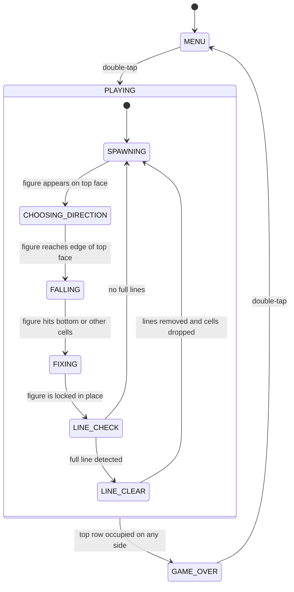

# CubeTetris — Game Design Document

## 1. Concept

### Overview

CubeTetris — классический тетрис, адаптированный для WowCube. Фигуры появляются на верхней грани куба, а игрок наклоном выбирает, в какую из четырёх боковых сторон фигура упадёт. На каждой боковой грани фигуры накапливаются снизу вверх. Когда горизонтальная линия заполнена на всех четырёх боковых гранях одновременно — она исчезает. Уникальность в том, что игрок должен стратегически распределять фигуры по четырём сторонам куба, чтобы собирать полные линии.

### Style & References

- **Art style:** минималистичный, чёрно-белый. Клетки — белые квадраты на чёрном фоне. Сетка обозначена тонкими серыми линиями.
- **Genre:** головоломка / аркада
- **Inspiration:** классический Tetris (1984), адаптированный для 3D-куба
- **Color palette:** чёрный фон, белые заполненные клетки, тёмно-серая сетка, белый текст счёта
- **Mood:** сосредоточенный, медитативный

### Scope

**MVP (minimum viable version):**

Foundation:
- [ ] Игровое поле: 4 боковые грани, каждая — сетка 10×10 клеток (2×2 квада по 5×5)
- [ ] Верхняя грань отображает счёт и текущую фигуру
- [ ] Нижняя грань всегда пустая (чёрная)
- [ ] Сетка из тонких серых линий на каждой боковой грани

Core mechanics:
- [ ] 7 стандартных фигур тетриса (I, O, T, S, Z, L, J) из 4 клеток
- [ ] Фигура появляется в углу верхней грани
- [ ] Игрок наклоном куба выбирает направление падения (одна из 4 боковых граней)
- [ ] Фигура переходит на выбранную боковую грань и падает вниз с постоянной скоростью
- [ ] Фигура останавливается при достижении дна или другой фигуры
- [ ] Горизонтальный полу-твист двигает фигуру влево/вправо
- [ ] Вертикальный полу-твист поворачивает фигуру
- [ ] Наклон куба двигает фигуру (когда она уже на боковой грани)
- [ ] Полный горизонтальный твист поворачивает фигуру
- [ ] Дабл-тап мгновенно опускает фигуру на дно
- [ ] Твисты НЕ перемещают заполненные клетки на боковых гранях

Secondary mechanics:
- [ ] Очистка линии: когда горизонтальный ряд заполнен на всех 4 боковых гранях одновременно — линия исчезает
- [ ] После очистки линии все клетки выше неё опадают вниз на 1 ряд
- [ ] Начисление очков за каждую очищенную линию
- [ ] Бонус за одновременную очистку нескольких линий

UI & feedback:
- [ ] Отображение счёта на верхней грани
- [ ] Экран меню (старт)
- [ ] Экран Game Over с финальным счётом
- [ ] Визуальная анимация исчезновения линии (мигание перед удалением)

Audio:
- (нет звуков в MVP)

**Future features (beyond MVP):**
- Превью следующей фигуры на верхней грани
- Звуковые эффекты (падение, очистка линии, game over)
- Пауза (тап по верхней грани)
- Увеличение скорости с ростом счёта / уровни
- Цветные фигуры (каждый тип фигуры — свой цвет)
- Таблица рекордов

### Design Assumptions

- **Фигура появляется в центре верхней грани** — на изображении указано "at the corner", но для удобства игрока и читаемости фигура появляется ближе к центру верхней грани, рядом с краем выбранной стороны.
- **Наклон на боковой грани двигает фигуру горизонтально** — когда фигура уже на боковой грани, наклон куба влево/вправо сдвигает фигуру, а не меняет грань.
- **Скорость падения постоянная** — подтверждено пользователем, без ускорения.
- **Нет звуков** — подтверждено пользователем для MVP.
- **Нет паузы** — подтверждено пользователем для MVP.
- **Нет превью следующей фигуры** — подтверждено пользователем для MVP.
- **Бонус за мульти-линию** — стандартная система очков тетриса: 1 линия = 100, 2 = 300, 3 = 500, 4 = 800 очков.

## 2. How It Plays

### Момент за моментом

Игрок держит куб верхней гранью вверх. На верхней грани отображается счёт. Новая фигура появляется на верхней грани.

**Фаза выбора направления:** Игрок наклоняет куб в сторону одной из 4 боковых граней. Фигура на верхней грани визуально сдвигается к краю выбранной стороны, показывая игроку куда она упадёт. Когда фигура достигает края верхней грани — она переходит на боковую грань.

**Фаза падения:** Фигура падает вниз по боковой грани (к нижней грани куба) с постоянной скоростью. Во время падения игрок может:
- Двигать фигуру влево/вправо горизонтальным полу-твистом или наклоном
- Поворачивать фигуру вертикальным полу-твистом или полным горизонтальным твистом
- Мгновенно сбросить фигуру на дно дабл-тапом

**Фиксация:** Когда фигура достигает дна или упирается в другую фигуру — она фиксируется. Её клетки становятся частью заполненного поля.

**Проверка линий:** После фиксации проверяется, заполнен ли какой-либо горизонтальный ряд на **всех 4 боковых гранях одновременно**. Один ряд — это 10 клеток на каждой из 4 граней = 40 клеток. Если ряд полный — он мигает и исчезает, все клетки выше опадают вниз.

**Новая фигура:** После фиксации и очистки линий на верхней грани появляется новая случайная фигура.

**Game Over:** Если при появлении новой фигуры на какой-либо боковой грани клетки достигли верхнего ряда (10-й ряд) и новая фигура не может быть размещена — игра заканчивается.

### Механика: выбор направления

- **Что видит игрок:** фигура на верхней грани сдвигается к краю в направлении наклона
- **Маппинг на куб:** наклон куба определяется акселерометром; гравитация указывает направление
- **Правила:** фигура переходит на боковую грань когда достигает края верхней грани
- **Edge case:** если игрок не наклоняет куб, фигура остаётся на верхней грани и не падает
- **Обратная связь:** фигура визуально скользит к краю

### Механика: движение фигуры

- **Что видит игрок:** фигура сдвигается на 1 клетку влево или вправо
- **Маппинг на куб:** горизонтальный полу-твист или наклон куба влево/вправо
- **Правила:** фигура не может выйти за границы грани (0-9 по горизонтали); не может пройти через заполненные клетки
- **Edge case:** если фигура у края грани — движение в эту сторону игнорируется
- **Обратная связь:** фигура мгновенно перемещается на 1 клетку

### Механика: поворот фигуры

- **Что видит игрок:** фигура поворачивается на 90° по часовой стрелке
- **Маппинг на куб:** вертикальный полу-твист или полный горизонтальный твист
- **Правила:** стандартная система поворотов тетриса; если поворот невозможен (стена или другие клетки) — поворот не происходит
- **Edge case:** фигура O (квадрат 2×2) не поворачивается
- **Обратная связь:** фигура мгновенно поворачивается

### Механика: быстрый сброс

- **Что видит игрок:** фигура мгновенно падает на дно
- **Маппинг на куб:** дабл-тап (двойное нажатие на любую грань)
- **Правила:** фигура перемещается вниз до первого препятствия и фиксируется
- **Обратная связь:** фигура мгновенно появляется на дне

### Механика: очистка линии

- **Что видит игрок:** заполненный ряд мигает 3 раза (белый → чёрный → белый → чёрный → белый → исчезает), затем все клетки выше опадают вниз
- **Правила:** проверяются все 10 рядов на всех 4 боковых гранях; ряд считается заполненным только если на **каждой** из 4 граней все 10 клеток в этом ряду заняты
- **Edge case:** несколько рядов могут быть очищены одновременно
- **Обратная связь:** мигание линии, обновление счёта

### Механика: твисты не двигают заполненные клетки

- Когда игрок делает твист (полный или полу-), заполненные клетки на боковых гранях **не перемещаются**. Твисты влияют только на текущую падающую фигуру.
- Визуально: экраны могут физически повернуться при твисте, но логическое положение заполненных клеток остаётся неизменным. После завершения твиста экраны возвращаются на место, и клетки отображаются в прежних позициях.

## 3. Game Objects

| Object | Appearance | Behavior | Max on screen |
|--------|------------|----------|---------------|
| Grid cell (empty) | Чёрный квадрат с тонкой серой рамкой, ~24×24px | Статичный, часть фона | 400 (10×10 × 4 грани) |
| Grid cell (filled) | Белый квадрат с тонкой чёрной рамкой, ~24×24px | Статичный после фиксации; опадает при очистке линии | до 400 |
| Active piece cell | Белый квадрат (чуть ярче или с обводкой), ~24×24px | Падает вниз, двигается по командам игрока | 4 (одна фигура = 4 клетки) |
| Score label | Белый текст на чёрном фоне | Обновляется при начислении очков | 1 (на верхней грани) |
| Direction indicator | Стрелка или подсветка края верхней грани | Показывает выбранное направление падения | 1 |

**Sprite budget:**

Сетка на боковых гранях — это фон, не спрайты. Заполненные клетки — спрайты.

Worst case: все 4 боковые грани почти полностью заполнены (9 рядов × 10 клеток × 4 грани = 360 клеток) + 4 клетки активной фигуры + счёт (до 8 глифов) + индикатор направления = ~375 спрайтов.

Это близко к лимиту 400. **Оптимизация:** сетку и заполненные клетки можно рисовать как фон (не спрайты), используя только спрайты для активной фигуры, счёта и UI-элементов. В этом случае бюджет спрайтов будет ~15-20, что далеко от лимита.

**Рекомендация:** заполненные клетки и сетку рисовать как фоновые пиксели (через прямую отрисовку на экран), а спрайты использовать только для активной фигуры и UI.

## 4. Progression & Difficulty

- **Progression:** бесконечная игра (endless). Нет уровней, нет финальной цели — игрок играет пока не проиграет.
- **Difficulty:** постоянная. Скорость падения не меняется. Сложность растёт естественно по мере заполнения боковых граней — чем больше клеток, тем сложнее размещать новые фигуры.
- **Win condition:** нет. Игра бесконечная, цель — набрать максимальный счёт.
- **Lose condition:** когда на любой боковой грани клетки достигают верхнего ряда и новая фигура не может быть размещена.
- **Scoring:**
  - 1 линия очищена = 100 очков
  - 2 линии одновременно = 300 очков
  - 3 линии одновременно = 500 очков
  - 4 линии одновременно = 800 очков

## 5. Controls

| Input | What It Does |
|-------|-------------|
| Half-twist left/right (horizontal) | Двигает падающую фигуру на 1 клетку влево/вправо |
| Half-twist up/down (vertical) | Поворачивает падающую фигуру на 90° |
| Twist left/right (full horizontal) | Поворачивает падающую фигуру на 90° |
| Twist up/down (full vertical) | Не используется |
| Tilt (наклон) | На верхней грани: выбирает направление падения. На боковой грани: двигает фигуру влево/вправо |
| Tap | Не используется |
| Double-tap | Мгновенно опускает фигуру на дно (hard drop) |

## 6. Screens & Feedback

### Во время игры

- **Верхняя грань (TOP):** отображает текущий счёт белым текстом по центру. Когда новая фигура появляется — она видна на верхней грани и скользит к краю выбранной стороны.
- **4 боковые грани (FRONT, RIGHT, BACK, LEFT):** игровое поле. Тонкая серая сетка 10×10. Заполненные клетки — белые. Активная падающая фигура — белая (возможно с лёгким отличием от заполненных клеток, например тонкая белая обводка).
- **Нижняя грань (BOTTOM):** всегда чёрная, пустая.

### Меню (старт)

- На верхней грани: название игры "TETRIS" белым текстом
- На боковых гранях: пустая сетка
- Запуск: дабл-тап на любой грани

### Game Over

- На верхней грани: "GAME OVER" и финальный счёт
- На боковых гранях: заполненные клетки остаются видимыми (замороженное состояние)
- Рестарт: дабл-тап на любой грани

### Visual feedback

- **Появление фигуры:** фигура мгновенно появляется на верхней грани
- **Выбор направления:** фигура плавно скользит к краю верхней грани в направлении наклона
- **Падение:** фигура перемещается вниз на 1 клетку каждый тик падения
- **Фиксация:** фигура мгновенно становится частью заполненного поля (без анимации)
- **Очистка линии:** заполненный ряд мигает 3 раза (~0.5 секунды), затем исчезает; клетки выше опадают вниз
- **Game Over:** все клетки на переполненной грани мигают

### Audio feedback

- Нет звуков в MVP.

## 7. Assets

### Sprites

- `cell_filled` — белый квадрат 24×24px с тонкой чёрной рамкой (1px). Заполненная клетка на боковой грани.
- `cell_active` — белый квадрат 24×24px с тонкой белой обводкой (2px) на чёрном фоне. Клетка активной падающей фигуры.
- `cell_ghost` — серый полупрозрачный квадрат 24×24px. Индикатор позиции приземления (ghost piece) — future feature.
- `arrow_indicator` — белая стрелка 48×48px, указывающая направление падения на верхней грани.

Total sprite assets: 3 (для MVP, без ghost piece)

### Sounds

- (нет звуков в MVP)

Total sound assets: 0

### Fonts

- `font_1` — основной шрифт для счёта и текста меню/game over. Крупный, читаемый, моноширинный.

## 8. Game Flow

### State descriptions

**MENU**
- **What the player sees:** "TETRIS" title on top face, empty grids on side faces
- **Active inputs:** double-tap to start
- **Transitions:** double-tap → PLAYING
- **Entry actions:** clear all grids, reset score to 0

**PLAYING → SPAWNING**
- **What the player sees:** empty top face with score; side faces show accumulated cells
- **Active inputs:** none (instant transition)
- **Transitions:** immediately spawns a random figure → CHOOSING_DIRECTION
- **Entry actions:** select random figure type (I/O/T/S/Z/L/J), place it at center of top face; check if any side face has top row occupied → GAME_OVER

**PLAYING → CHOOSING_DIRECTION**
- **What the player sees:** figure on top face; figure slides toward the edge the player tilts toward; arrow indicator shows direction
- **Active inputs:** tilt (choose direction)
- **Transitions:** figure reaches edge of top face → FALLING
- **Entry actions:** start reading accelerometer for tilt direction

**PLAYING → FALLING**
- **What the player sees:** figure on a side face, falling down one cell at a time
- **Active inputs:** horizontal half-twist (move left/right), vertical half-twist (rotate), full horizontal twist (rotate), tilt (move left/right), double-tap (hard drop)
- **Transitions:** figure hits bottom or occupied cell below → FIXING
- **Entry actions:** place figure at top of chosen side face, start fall timer

**PLAYING → FIXING**
- **What the player sees:** figure stops moving, its cells become part of the filled grid
- **Active inputs:** none (instant transition)
- **Transitions:** immediately → LINE_CHECK
- **Entry actions:** convert active piece cells to filled cells

**PLAYING → LINE_CHECK**
- **What the player sees:** no visible change (instant check)
- **Active inputs:** none
- **Transitions:** full line found → LINE_CLEAR; no full lines → SPAWNING
- **Entry actions:** check all 10 rows across all 4 side faces

**PLAYING → LINE_CLEAR**
- **What the player sees:** filled rows blink 3 times, then disappear; cells above drop down
- **Active inputs:** none (animation plays)
- **Transitions:** animation complete → SPAWNING
- **Entry actions:** start blink animation, add score based on number of lines cleared, remove filled rows, drop cells above

**GAME_OVER**
- **What the player sees:** "GAME OVER" and final score on top face; side faces show frozen grid state with blinking on the overflowed face
- **Active inputs:** double-tap to restart
- **Transitions:** double-tap → MENU
- **Entry actions:** display game over text, stop all game logic
