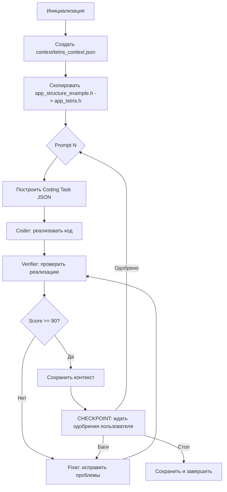

# CubeTetris — План оркестрации реализации

## Статус пререквизитов

| Файл | Статус | Описание |
|------|--------|----------|
| `plans/tetris_prompts.md` | ✅ | 16 промптов реализации |
| `plans/tetris_gdd.md` | ✅ | Документ игрового дизайна |
| `templates/app_ai_template.h` | ✅ | API-референс OctaviOS |
| `src/app_structure_example.h` | ✅ | Скелет для копирования |
| `src/app_tetris.h` | ❌ Создать | Из `app_structure_example.h` |
| `context/tetris_context.json` | ❌ Создать | Начальный контекст |

## Архитектура пайплайна

## Последовательность из 16 промптов

### Foundation: Промпты 1-2
| # | Название | Категория | Зависимости | Ключевой результат |
|---|---------|-----------|-------------|-------------------|
| 1 | Scaffold, Data Structures, Engine Init | foundation | — | Чёрный фон на всех 24 экранах |
| 2 | Score Label on Top Face | foundation | 1 | Текст 0 на верхней грани |

### Core: Промпты 3-12
| # | Название | Категория | Зависимости | Ключевой результат |
|---|---------|-----------|-------------|-------------------|
| 3 | Spawn Active Piece | core | 1,2 | 4 белых квадрата на FRONT |
| 4 | Piece Gravity | core | 1-3 | Фигура падает вниз |
| 5 | Floor Collision + Landing | core | 1-4 | Фигура останавливается + респаун |
| 6 | Horizontal Movement | core | 1-5 | Полу-твисты двигают фигуру |
| 7 | Piece Rotation | core | 1-6 | Вертикальные твисты вращают |
| 8 | Cell Collision / Stacking | core | 1-7 | Фигуры стакаются корректно |
| 9 | Line Detection + Clearing | core | 1-8 | Полные ряды исчезают, очки |
| 10 | Hard Drop — Double-Tap | core | 1-9 | Мгновенный сброс фигуры |
| 11 | Game Over Detection | core | 1-10 | Игра замирает при переполнении |
| 12 | Tilt Direction + Side Transfer | core | 1-11 | Выбор грани наклоном куба |

### UI: Промпты 13-14
| # | Название | Категория | Зависимости | Ключевой результат |
|---|---------|-----------|-------------|-------------------|
| 13 | Menu State | ui | 1-3,12 | Экран TETRIS + старт по двойному тапу |
| 14 | Game Over State | ui | 1-3,11,13 | GAME OVER текст + рестарт |

### Polish: Промпты 15-16
| # | Название | Категория | Зависимости | Ключевой результат |
|---|---------|-----------|-------------|-------------------|
| 15 | Line Clear Blink Animation | polish | 1,9 | Мигание 3 раза перед удалением ряда |
| 16 | Game Over Blink Animation | polish | 1,11,14 | Мигание переполненной грани |

## Правила пайплайна

- **Foundation промпты 1-2**: ВСЕГДА ждать верификации — последующие промпты зависят от результата
- **Core промпты 3-12**: последовательно, каждый зависит от предыдущего — ждать верификации
- **UI промпты 13-14**: зависят от core — ждать верификации
- **Polish промпты 15-16**: изолированные — теоретически безопасно для пайплайна, но для надёжности — последовательно

## Ограничения

- **Ассеты** (PNG, MP3) создаются вручную — агенты НЕ генерируют спрайты/звуки
- Файл `_ids.h` генерируется утилитой упаковки — агенты НЕ редактируют его
- Весь код в одном файле: `src/app_tetris.h`
- `SPRITES_CAP = 400` — максимум объектов сцены
- `BMP_001` используется как placeholder до создания реальных ассетов
- `gObjects[0]` невалиден — итерация с индекса 1

## Начало работы

Стартуем с **Prompt 1: Foundation** — создание скаффолда, структур данных и инициализации движка.
