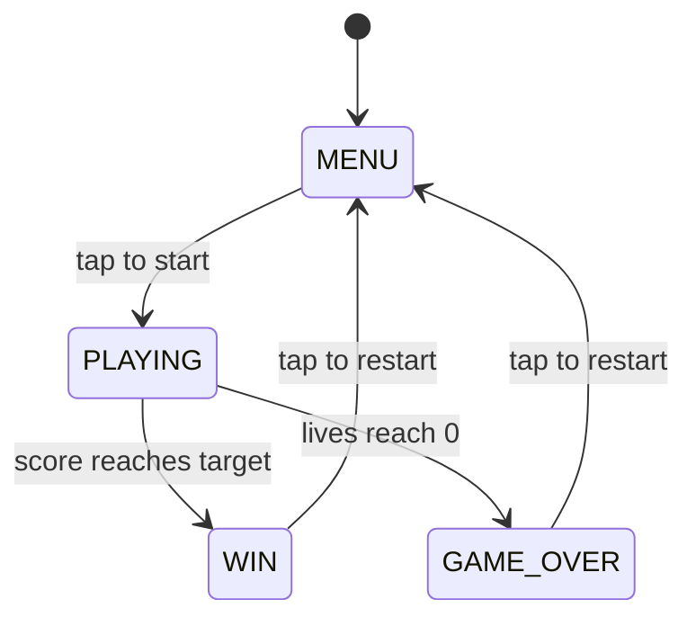
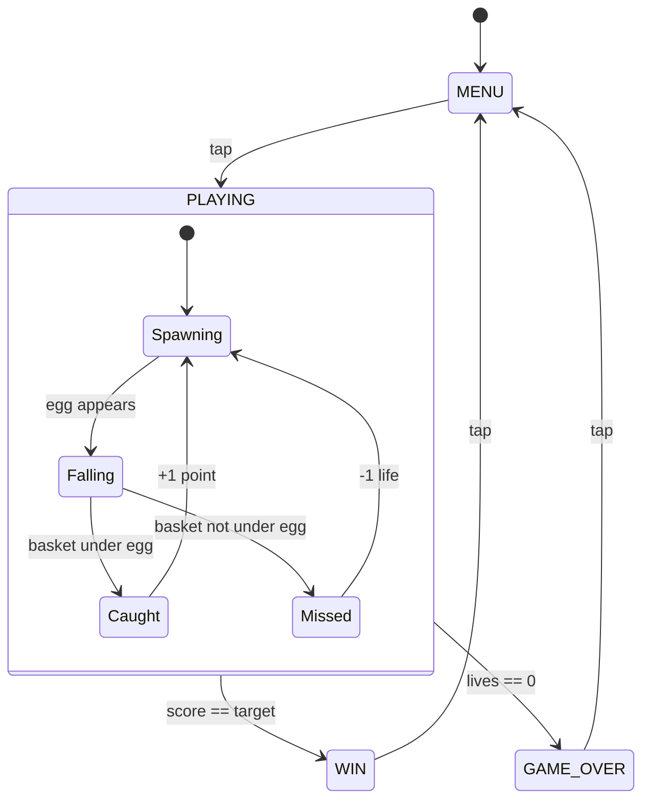

# WowCube Game Designer

Create a non-technical Game Design Document (GDD) from a user's game idea, accounting for WowCube hardware and interaction specifics. The GDD is consumed by `technical_prompter` (decomposition into prompts) and then `cube_orchestrator` (execution).

**Core principle:** To produce a high-quality GDD, the agent MUST first ask as many clarifying questions as needed to fully understand the user's vision. Never guess — always ask. The discovery conversation is not optional; it is the most important part of the process.

## When to Use

- User describes a game idea or concept for the WowCube
- User says "make a game," "design a game," or "create a game"
- User provides a genre, theme, or mechanic and expects a full game design
- An orchestrator needs a GDD before handing off to the technical prompter

## When NOT to Use

- A GDD already exists and needs implementation prompts — use `technical_prompter` instead
- User wants to modify existing code — this skill produces design documents, not code

## WowCube Device Essentials

The GDD must account for these device characteristics (expressed in player-friendly terms, never as code):

- **The cube has 6 faces**, each with **4 small screens** (24 screens total)
- **Screens are 240x240 pixels** with a **physical gap** (border) between them
- **Player interactions**: twist a face row (full or half twist), tap a face, tilt the cube
- **Twists** rotate a row of 4 screens — this is the primary input for most games
- **Half-twists** shift screens partially — useful for fine movement
- **Taps** are detected per face (not per screen)
- **Tilt/gravity** detects which face is on top or bottom
- The cube can display on all 24 screens simultaneously — not all are visible to the player at once
- **~20 frames per second** tick rate — animations should be simple and clear
- **Maximum ~400 sprites** on screen at once across all faces — this is a hard budget

## Workflow

### Step 1: Discovery Interview (MANDATORY)

**Do NOT write the GDD until you have asked the user enough questions to fully understand their game idea.**

#### How to Generate Questions

There is no fixed list of questions. Instead, the agent must:

1. **Read the user's initial prompt** carefully and identify what is clear vs. what is ambiguous or missing.
2. **Read `${CLAUDE_PLUGIN_ROOT}/templates/app_ai_template.h`** to understand the platform's game engine patterns, capabilities, and constraints (game states, object behaviors, screen layout, input handling, animation patterns). Use this technical knowledge to identify design questions the user hasn't addressed — but phrase all questions in plain, non-technical language.
3. **Cross-reference the user's idea against the WowCube Device Essentials** listed above. For each cube mechanic (twists, half-twists, taps, tilt, multi-face display), determine whether the user's idea has a clear mapping. If not, ask about it.
4. **Think about the game holistically** — consider gameplay flow, win/lose conditions, progression, visual style, audio, and player motivation. Ask about anything that is unclear or unspecified.

#### Interview Rules

- **Ask every question you have.** Group related questions together for efficiency (2-4 rounds of questions is typical), but do not hold back questions to be polite. More questions upfront = better GDD.
- **Acknowledge the idea first** — briefly restate what you understood from the user's prompt to confirm alignment before asking questions.
- **After receiving answers, check for gaps** — if answers raise new questions or leave things ambiguous, ask follow-up questions. Continue until you are confident you understand the full game design.
- **Confirm understanding** — before proceeding to write the GDD, summarize the complete game concept back to the user and get their approval.
- If the user says "you decide" for a specific aspect, make a design decision and note it as an assumption in the GDD.
- If the user wants to skip the interview entirely, explain briefly why the questions matter for quality, then ask at minimum about: the core mechanic, how twists should work in the game, and win/lose conditions.

### Step 2: Study the Platform

Read the API reference for internal understanding only:
- `${CLAUDE_PLUGIN_ROOT}/templates/app_ai_template.h` — OctaviOS API reference and engine patterns (SOURCE OF TRUTH, do NOT copy demo code)

Use this knowledge solely to validate that the user's design is feasible on the hardware. If any aspect of the design conflicts with platform limitations, go back to the user and explain the constraint in plain language, then ask how they'd like to adjust.

**None of this technical knowledge should appear in the GDD.**

### Step 3: Write the GDD

Create a markdown file at `plans/<game_name>_gdd.md`. The GDD is a **non-technical creative document** — it describes the game from the player's perspective. No code, no API names, no implementation details.

The GDD structure is designed so that `technical_prompter` can easily extract:
- **Game objects** → sprite definitions and struct fields
- **Controls** → input handler logic
- **Game flow states** → game state machine and transitions
- **Assets** → sprite/sound IDs and resource loading
- **MVP scope items** → individual implementation prompts

```markdown
# <Game Name> — Game Design Document

## 1. Concept

### Overview
2-3 sentences: what the game is, what makes it fun, why it works on the cube.

### Style & References
- Art style (e.g., pixel-art, minimal, cartoon)
- Genre
- Inspiration games/references
- Color palette and mood

### Scope

**MVP (minimum viable version):**
Group features by implementation area. Each item should be a discrete,
testable behavior — these map roughly to implementation prompts later.

Foundation:
- [ ] Feature (e.g., "game board displays on all 6 faces")
- [ ] ...

Core mechanics:
- [ ] Feature (e.g., "twisting moves tiles between screens")
- [ ] ...

Secondary mechanics:
- [ ] Feature (e.g., "bonus tiles appear every 30 seconds")
- [ ] ...

UI & feedback:
- [ ] Feature (e.g., "score displays on top face")
- [ ] ...

Audio:
- [ ] Feature (e.g., "chime plays on successful match")
- [ ] ...

**Future features (beyond MVP):**
- Feature A
- Feature B
- ...

### Design Assumptions
List any decisions made by the agent that were not explicitly stated by the user:
- Assumption — rationale
- ...
(If none, state "All design decisions were confirmed with the user.")

## 2. How It Plays

Describe the core gameplay experience in plain language. What does the player do moment-to-moment? What makes it engaging?

For each distinct mechanic, describe:
- What the player sees and does
- How it maps to cube interactions (twist/tap/tilt)
- Rules and edge cases
- What feedback the player gets (visual and audio)

## 3. Game Objects

Describe every type of object in the game with sprite count estimates:

| Object | Appearance | Behavior | Max on screen |
|--------|------------|----------|---------------|
| ... | What it looks like | What it does | e.g., 24 (one per screen) |

**Sprite budget:** estimate total worst-case sprites across all faces.
Hard limit is 400. If the design approaches this, note it and suggest
which objects could be reduced.

## 4. Progression & Difficulty

- How the game progresses (levels, waves, endless, etc.)
- What changes as difficulty increases
- Win condition
- Lose condition
- Scoring system (if any)

## 5. Controls

| Input | What It Does |
|-------|-------------|
| Twist left/right | ... |
| Half-twist left/right | ... |
| Twist up/down | ... |
| Half-twist up/down | ... |
| Tap | ... |
| Tilt/gravity | ... |

Mark any input as "not used" if the game does not use it.

## 6. Screens & Feedback

- What the player sees on each face during gameplay
- Where score/status info is displayed
- Menu screens (start, pause, game over, win)
- Visual feedback (animations, color changes, effects)
- Audio feedback (when sounds play, what mood they convey)

## 7. Assets

### Sprites
- `<snake_case_name>` — description and approximate size (e.g., "48x48px")
- ...

Total sprite assets: N

### Sounds
- `<snake_case_name>.mp3` — description
- ...

Total sound assets: N

### Fonts
- `<font_name>` — usage description
- ...

## 8. Game Flow

Describe the full flow of the game using a **Mermaid state diagram**.
Each state becomes a game state in implementation. Transitions between
states map to game logic that the technical prompter will decompose.

Use Mermaid `stateDiagram-v2` syntax for a visual, readable flowchart:



Make the diagram detailed — include all transitions with their trigger
conditions on the arrows. If a state has internal sub-states (e.g.,
PLAYING has "spawning egg" → "egg falling" → "catch/miss"), show them
as a nested state:



Below the diagram, describe each state:
- **Name** — clear, descriptive (e.g., MENU, PLAYING, GAME_OVER, WIN)
- **What the player sees** — screen contents and active objects
- **Active inputs** — which controls respond in this state
- **Transitions** — what triggers moving to another state
- **Entry actions** — what happens when entering this state (sounds, animations, resets)
```

### Step 4: Validate the Design

Before finalizing, verify:

1. Every player action (twist, tap, tilt) has a defined response in every game state, or is explicitly marked "not used"
2. Win and lose conditions are complete — no dead-end states
3. The asset list covers every visual and audio element mentioned in the design
4. Asset names are unique, descriptive, and use `snake_case`
5. The game is feasible given the device constraints (sprite count, screen count, input types)
6. **Sprite budget** — worst-case total sprites <= 400
7. The controls summary matches the mechanics described in the gameplay section
8. The document is understandable by someone who has never seen WowCube code
9. All user answers from the discovery interview are reflected in the document
10. All assumptions are explicitly listed in the Design Assumptions section
11. The GDD contains zero technical implementation details — no code, no API names, no engine internals
12. **MVP scope items are grouped** by area (foundation/core/secondary/ui/audio) and each item is a discrete testable behavior
13. **Game flow states** are named clearly and all transitions are defined

## Important: Assets Are Created Manually

The GDD lists all required assets (sprites, sounds, fonts), but:
- **Sprite PNGs and sound MP3s are created by humans**, not by agents
- **The `_ids.h` file is generated by the asset packing tool**, not edited by code agents
- The GDD's asset list serves as a **spec for the artist/designer** — it must be detailed enough for them to create the assets independently
- Implementation can begin before all assets exist (using placeholder BMP IDs), but the game won't be visually complete until assets are provided

## Output

The final GDD is written to `plans/<game_name>_gdd.md`.

After writing, provide a brief summary:
- The core game mechanic
- How many assets are estimated (sprites + sounds)
- Estimated worst-case sprite count vs. 400 budget
- Which cube inputs are used
- Any design assumptions made
- Invite the user to review and request changes
- Note: when ready, use `technical_prompter` to decompose this GDD into implementation prompts

## Writing Guidelines

- **No code, no API names, no struct names, no implementation details** — the GDD is purely a creative design document
- Use player-facing language: "face" not "plane", "screen" not "quad", "twist" not "twid"
- Describe behaviors, not implementations: "figures fall down when there's empty space below" not "gravity applies OCT_TM_walk"
- Be specific about visuals: describe what things look like, how they animate, what colors they use
- Be specific about audio: describe when sounds play and what mood they convey
- Asset names must be clear enough that an artist could create them from the name + description alone
- Use flow diagrams and state descriptions to make the game flow crystal clear
- **Group MVP scope items** so they map naturally to implementation phases — this directly helps the `technical_prompter` create better prompts
